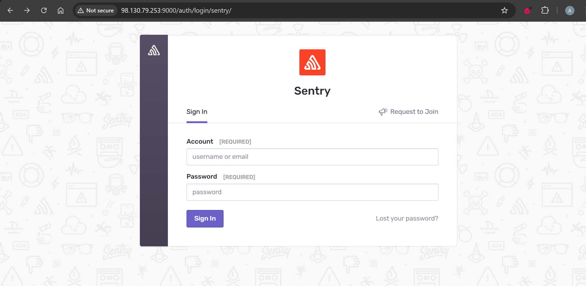
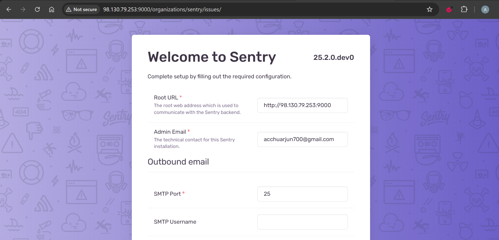
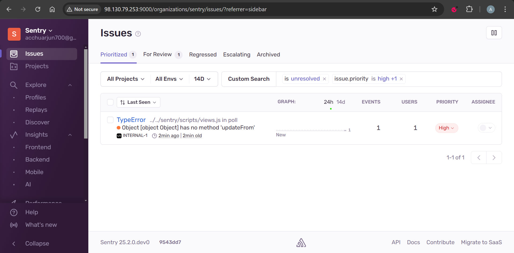

# Self-Hosted Sentry on AWS

## Project Description

This repository automates the deployment of a Self-Hosted Sentry on an AWS Virtual Machine using Terraform for infrastructure provisioning and Ansible for configuration. It simplifies the setup of Sentry, providing a ready-to-use solution for error tracking and performance monitoring on AWS.

Sentry is an open-source software platform used to track, manage, and correct errors in applications. It operates by collecting information about errors and exceptions that occur in the code and providing an intuitive interface to visualize and analyze these issues.

### Key Features:
- **Terraform**: Automates the provisioning of AWS infrastructure, including EC2 instances and security groups.
- **Ansible**: Configures and installs Sentry on the provisioned VM.
- **AWS Integration**: The setup is tailored for deployment on Amazon Web Services (AWS).

### Workflow:
1. **Terraform Module**: Deploys the necessary infrastructure on AWS, including VPC, EC2 instance, and security group configuration.
2. **Ansible Playbook**: Installs Docker and Sentry on the newly created EC2 instance.
3. **Self-Hosted Sentry**: Sentry is fully deployed and ready for use on the cloud VM.

This project is ideal for developers looking to set up a self-hosted Sentry instance on AWS using Infrastructure as Code (IaC) principles. The use of Terraform and Ansible allows for easy customization and scalability.

---

# Project Setup

This project involves provisioning an AWS EC2 instance with Terraform and configuring it with Ansible for self-hosted Sentry installation.

## Pre-requisites

Before starting, ensure you have the following tools and resources:

### 1. **AWS Account**
   - You need an AWS account to deploy resources on AWS.

### 2. **Terraform**
   - **Required Version**: `~> 1.10.x`
   - Install Terraform to manage and deploy AWS resources.
   - Follow the official guide to install [Terraform](https://learn.hashicorp.com/tutorials/terraform/install-cli).
   - The version used in this project:
     ```bash
     Terraform v1.10.4
     ```

### 3. **Ansible**
   - **Required Version**: `~> 2.13.x`
   - Install Ansible for configuration management of the VM.
   - Follow the official guide to install [Ansible](https://docs.ansible.com/ansible/latest/installation_guide/intro_installation.html).
   - The version used in this project:
     ```bash
     ansible [core 2.13.13]
     ```

### 4. **AWS CLI**
   - **Required Version**: `~> 2.23.x`
   - Install the AWS Command Line Interface (CLI) to configure AWS credentials and interact with AWS services.
   - Follow the official guide to install [AWS CLI](https://docs.aws.amazon.com/cli/latest/userguide/install-cliv2.html).
   - The version used in this project:
     ```bash
     aws-cli/2.23.0
     ```

---

## AWS CLI Configuration

To connect Terraform with AWS, you need to configure the AWS CLI with your AWS credentials. Run the following command:

```bash
aws configure
```

You will be prompted for:

- **AWS Access Key ID**: Your AWS access key ID.
- **AWS Secret Access Key**: Your AWS secret access key.
- **Default Region Name**: Choose your AWS region (e.g., `ap-south-2` for Mumbai).
- **Default output format**: Choose `json` (or `text`/`table` as needed).

---

## S3 Backend Configuration (Optional)

If you want to store the Terraform state file in an S3 bucket (recommended for team-based deployments), follow these steps:

1. **Create an S3 bucket** to store the state file:

```bash
aws s3api create-bucket --bucket <bucket-name> --region <region> --create-bucket-configuration LocationConstraint=<region>
```

2. **Enable versioning** on the bucket:

```bash
aws s3api put-bucket-versioning --bucket <bucket-name> --versioning-configuration Status=Enabled --region <region>
```

3. **Set up server-side encryption** on the S3 bucket:

```bash
aws s3api put-bucket-encryption --bucket <bucket-name> --server-side-encryption-configuration '{
  "Rules": [
    {
      "ApplyServerSideEncryptionByDefault": {
        "SSEAlgorithm": "AES256"
      }
    }
  ]
}' --region <region>
```

4. **Create a DynamoDB table** for state locking:

```bash
aws dynamodb create-table --table-name terraform-state-lock --attribute-definitions AttributeName=LockID,AttributeType=S --key-schema AttributeName=LockID,KeyType=HASH   --provisioned-throughput ReadCapacityUnits=5,WriteCapacityUnits=5 --region <region>
```

---

# Installation

## Terraform Setup

After configuring the AWS CLI and the S3 backend (optional), follow these steps to provision the AWS EC2 instance:

1. **Set the correct values in `terraform.tfvars` file**: This file contains the required variables for provisioning the EC2 instance. Ensure all values are accurate.

2. **Provision the EC2 instance** by running the following Terraform commands:

```bash
terraform init
terraform plan
terraform apply
```

   - Terraform will create a `.pem` SSH key pair and store it in `terraform/secrets/key-name.pem`.
   - It will also update the Ansible inventory file located at `ansible/inventory/hosts.ini`.

---

## Ansible Setup

After provisioning the EC2 instance with Terraform, proceed with the Ansible setup:

### 1. **Install Ansible Dependencies**

   - Change to the Ansible directory and install the required roles:

```bash
cd ansible/
ansible-galaxy install -r requirements.yml
```

### 2. **Run Ansible Playbook**

   - Run the Ansible playbook to set up and configure Sentry:

```bash
ansible-playbook -e "SENTRY_ADMIN_EMAIL=your_email@example.com SENTRY_ADMIN_PASSWORD=your_password" sentry.yml
```

---

## Deployment Logs

The logs for the Terraform and Ansible deployment can be found in the `logs/` folder:

- [terraform_output.log](results/logs/terraform.log)
- [ansible_output.log](results/logs/ansible.log)

These logs provide a detailed output of the deployment process, including the creation of resources and installation of Sentry.

---

## Screenshots

Here are some screenshots of the sentry deployment:


*The Sentry login page.*


*The Sentry welcome page.*


*The Sentry dashboard page.*

---

## Helpful Resources

1. [Sentry Official Website](https://sentry.io/welcome/)
2. [Self-Hosted Sentry GitHub Repository](https://github.com/getsentry/self-hosted)
3. [Self-Hosted Sentry Documentation](https://develop.sentry.dev/self-hosted/)
4. [Sentry Community - Discord](https://discord.com/invite/sentry)

---

## Contact

Feel free to reach out to me through the following channels:

[](https://github.com/Arjun245)
[](https://www.linkedin.com/in/arju24)
[](mailto:acchuarjun700@gmail.com)